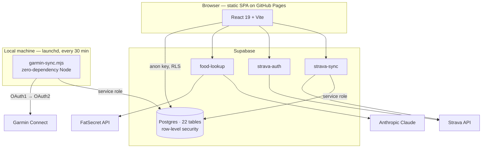
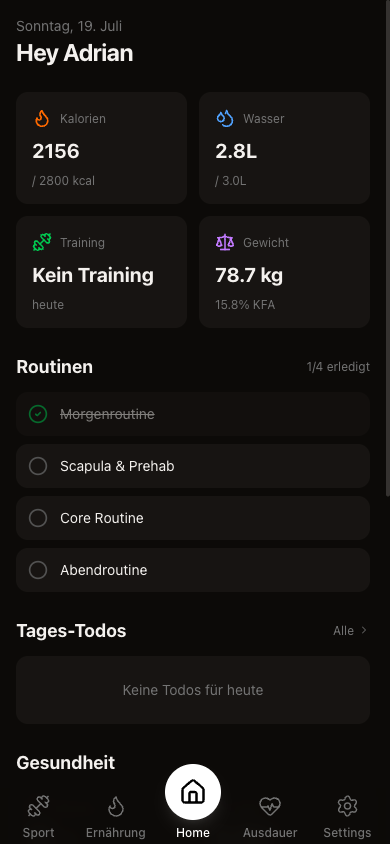
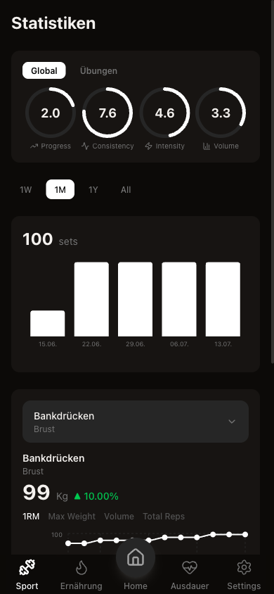
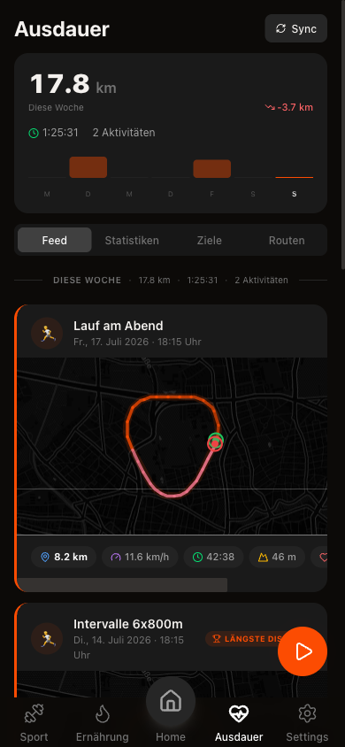
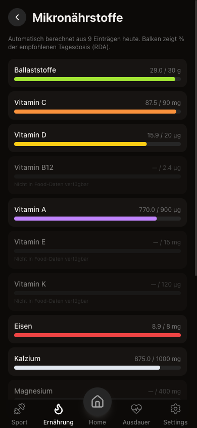

# Life Manager

A self-hosted health and training tracker that unifies strength training, cardio, nutrition, and wearable biometrics in one mobile web app.

Fitness data is fragmented across vendor silos: strength logs in one app, runs in Strava, sleep and HRV locked inside Garmin Connect, nutrition somewhere else. None of them answer a question like "did my HRV drop in the weeks my training volume spiked?" Life Manager pulls all of it into a single Postgres database behind a single UI, so the data can actually be correlated. It ships as an installable mobile web app deployed as a static bundle, with no backend server to maintain.

## Features

- **Strength training** — training plans, per-set logging (weight × reps), rest timer, exercise history
- **Training analytics** — estimated 1RM via the Brzycki formula, volume and max-weight trends per exercise, a 12-week training heatmap, and scored progress/consistency/intensity/volume metrics
- **Routines** — recurring routines with weekday scheduling and date ranges, per-step completion tracking, swipe-to-delete
- **Cardio** — Strava OAuth import plus manual entry, GPS live tracking on a Leaflet map with screen wake lock, and per-activity stream charts for pace, heart rate, and elevation
- **Nutrition** — barcode scanning, FatSecret database search, LLM-parsed freetext entry, macro and micronutrient tracking against RDA targets, water logging
- **Wearable biometrics** — daily Garmin sync of resting heart rate, HRV, sleep stages and score, Body Battery, stress, VO2max, and steps
- **Dashboard** — daily overview of calories, water, training status, routines, and the latest biometrics

## Tech Stack


**Frontend** — React 19, TypeScript, Vite, Tailwind CSS 4, Radix UI primitives, Recharts, Leaflet, React Router 7
**Backend** — Supabase (Postgres with row-level security, Deno edge functions)
**Integrations** — Garmin Connect, Strava, FatSecret, Anthropic Claude
**CI/CD** — GitHub Actions build and deploy to GitHub Pages

## Architecture

The app is a static SPA. Everything server-side runs either in Supabase edge functions or, for one specific case, on a local machine.



Two design decisions worth calling out:

**Garmin sync runs locally, not in an edge function.** Garmin's `connectapi.garmin.com` gateway hard-blocks datacenter IP ranges — every request from Supabase's infrastructure returns `429`. The sync therefore runs on a residential connection via a `launchd` job. `scripts/garmin-sync.mjs` implements Garmin's undocumented auth flow (SSO ticket → HMAC-SHA1-signed OAuth1 request → OAuth2 token exchange) with no third-party dependencies, and caches tokens locally so a 30-minute polling interval does not trigger a full SSO login on every run.

**Secrets never reach the browser.** Only the Supabase URL and anon key are inlined into the bundle. Third-party API credentials live in edge function secrets, and the service role key exists only in the local sync script's environment.

## Screenshots

| Dashboard | Training analytics | Cardio | Micronutrients |
| --- | --- | --- | --- |
|  |  |  |  |

Taken from demo mode, so the data shown is generated, not personal.

## Setup

### Try it without a backend

Demo mode runs the whole app against in-memory fixtures — no Supabase project,
no API keys, no `.env`:

```bash
git clone https://github.com/AdrianAdem/life-manager.git
cd life-manager
npm install
npm run demo           # http://localhost:5173/life-manager/
```

It ships twelve weeks of training logs, a week of meals, five runs with GPS
tracks, and two weeks of Garmin biometrics, all generated relative to today.
Writes work and persist for the session. The GPS tracks are synthetic loops
through a public park, not recorded routes.

### Full installation

- Node.js 20+
- A Supabase project

```bash
cp .env.example .env   # then fill in the values below
npm run dev            # http://localhost:5173
```

### Environment variables

Anything prefixed with `VITE_` is inlined into the public browser bundle at build time. Never put a secret behind that prefix.

| Variable | Scope | Purpose |
| --- | --- | --- |
| `VITE_SUPABASE_URL` | Browser (public) | Supabase project URL |
| `VITE_SUPABASE_ANON_KEY` | Browser (public) | Supabase anon key, constrained by RLS |
| `GARMIN_EMAIL` | Local script | Garmin Connect account |
| `GARMIN_PASSWORD` | Local script | Garmin Connect password |
| `SUPABASE_SERVICE_ROLE_KEY` | Local script | Bypasses RLS for sync writes — server-side only |

Set these in the Supabase dashboard under **Edge Functions → Secrets**, not in `.env`:

| Secret | Used by |
| --- | --- |
| `FATSECRET_CLIENT_ID` / `FATSECRET_CLIENT_SECRET` | `food-lookup` |
| `ANTHROPIC_API_KEY` | `food-lookup` freetext parsing |
| `STRAVA_CLIENT_ID` / `STRAVA_CLIENT_SECRET` / `STRAVA_REDIRECT_URI` | `strava-auth`, `strava-sync` |

### Deployment

Pushing to `main` triggers `.github/workflows/deploy.yml`, which builds and publishes to GitHub Pages. Add `VITE_SUPABASE_URL` and `VITE_SUPABASE_ANON_KEY` as repository secrets first.

## Usage

```bash
npm run dev              # dev server with HMR
npm run demo             # dev server with in-memory fixtures, no backend needed
npm run build            # typecheck + production build
npm run preview          # serve the production build locally
npm run lint             # ESLint
npm run garmin:sync         # sync the last 7 days of Garmin data
npm run garmin:sync -- 30   # sync the last 30 days
```

To run the Garmin sync automatically every 30 minutes, generate the launchd
agent from the template (it substitutes your Node path and repo location):

```bash
sed -e "s|__NODE_BIN__|$(which node)|" -e "s|__PROJECT_DIR__|$PWD|" \
  scripts/com.life-manager.garmin-sync.plist \
  > ~/Library/LaunchAgents/com.life-manager.garmin-sync.plist
launchctl load ~/Library/LaunchAgents/com.life-manager.garmin-sync.plist
```

Edge functions deploy with the Supabase CLI:

```bash
supabase functions deploy food-lookup
```

## Project Structure

```
src/
  features/        one directory per feature area (dashboard, sport, nutrition, ausdauer, ...)
  components/      shared UI primitives and app layout
  lib/             Supabase client, API service wrappers, domain calculations
  types/           database row types
supabase/
  functions/       Deno edge functions
scripts/
  garmin-sync.mjs  local Garmin Connect sync
```

## Notes

This is a personal single-user application. It uses a fixed user ID rather than Supabase Auth, and the RLS policies on app tables are permissive by design. Adding real authentication would be a prerequisite for any multi-user deployment.

Garmin Connect exposes no public API for this data. The sync script targets an undocumented, unofficial endpoint set that Garmin may change or block at any time.

## License

MIT — see [LICENSE](LICENSE).
